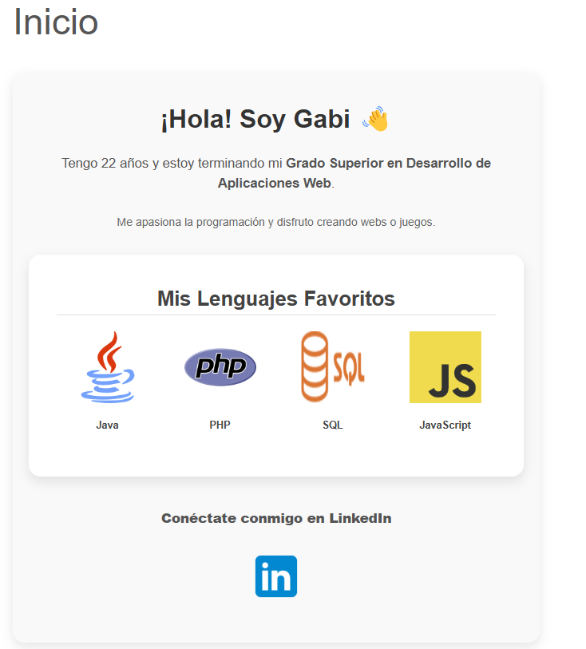
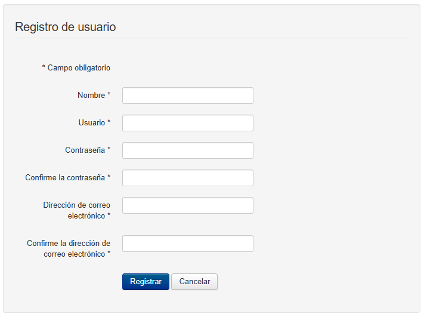
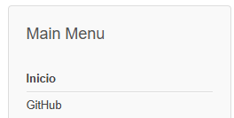
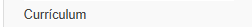
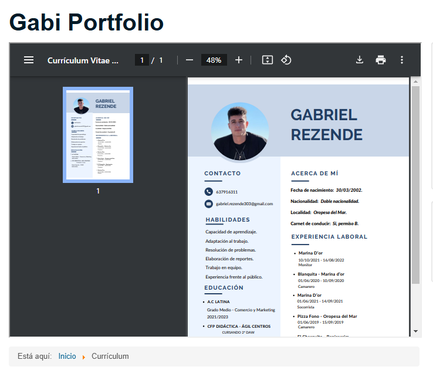
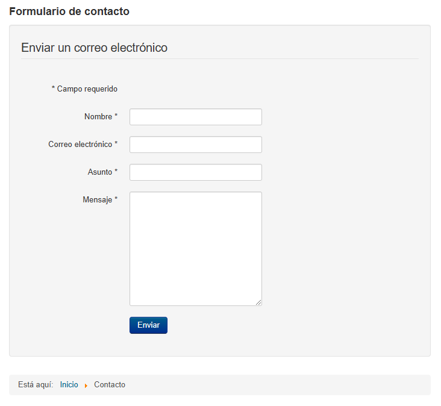

# Página principal, que será la página de presentación de uno mismo, incluyendo tu descripción. 1 punto.

# Uso de diferentes usuarios, mediante la opción de registro. 1 punto.

# Uso de un menú o de una zona personalizada para el usuario registrado. 1 puntos.

# Visión del repositorio personal de GitHub. 1,5 punto.

# Visor de pdf que contenga el Currículum, con opción de descarga. El Currículum debe estar en formato .pdf . 1 puntos.

# Uso de un tema común propio (No el base de Cassiopeia) para todo el sitio Web. 0,5 puntos.

# Zona para contactar, con enlace para enviar un correo. 1 puntos.

# Extras. 0,5 puntos máximo cada extra, 1 punto máximo en total.

# Documentación. Deben incluir imágenes que demuestren los contenidos evaluables. Además deberá incluir el mapa de la web y el diseño de la interfaz. 2 puntos.

# Como punto adicional se sugiere la subida o desarrollo del sitio web en un hosting real de internet, preferiblemente gratuito, donde cualquier usuario pueda acceder a él.
