# Página principal, que será la página de presentación de uno mismo, incluyendo tu descripción. 1 punto.

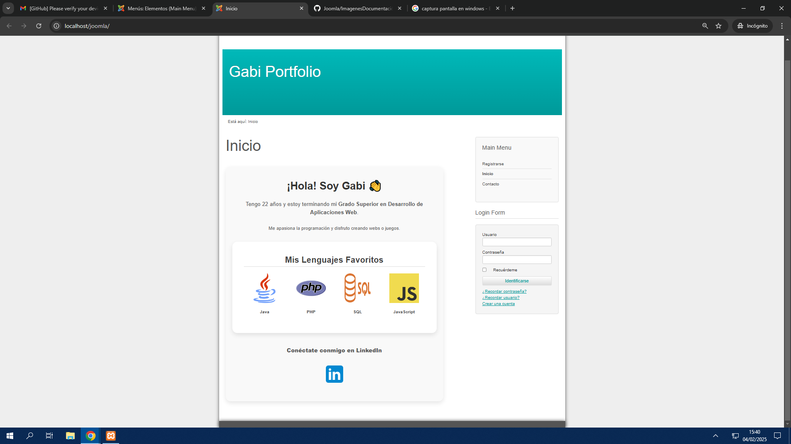

# Uso de diferentes usuarios, mediante la opción de registro. 1 punto.

# Uso de un menú o de una zona personalizada para el usuario registrado. 1 puntos.

 ### Este es el menu de un user, sin ningun permiso. 
 

 ### Este es el menu deL Admin, CON permisos.
  

# Visión del repositorio personal de GitHub. 1,5 punto.
 ### Enlace directo a github a traves del menú
 

# Visor de pdf que contenga el Currículum, con opción de descarga. El Currículum debe estar en formato .pdf . 1 puntos.

# Uso de un tema común propio (No el base de Cassiopeia) para todo el sitio Web. 0,5 puntos.

# Zona para contactar, con enlace para enviar un correo. 1 puntos.

# Extras. 0,5 puntos máximo cada extra, 1 punto máximo en total.

#### He creado el MODO OSCURO que es un boton que esta en la parte de abajo dxe la pagina, lo que hace es que la pagina se vuelve oscura.

##### Foto del boton.

###### Foto pagina contacto sin el modo osuro.

.png)

###### Foto pagina contacto CON el modo osuro.

###### Foto pagina MiCuenta sin el modo osuro.

.png)

###### Foto pagina MiCuenta CON el modo osuro.

.png)

#### He creado una flecha hacia arriba como botón que si le pulsas sube la pagina hasta arriba para que no tengas que estar subiendo con el mause.

##### Foto del icono de la flecha.
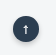

##### Como queda en la página.

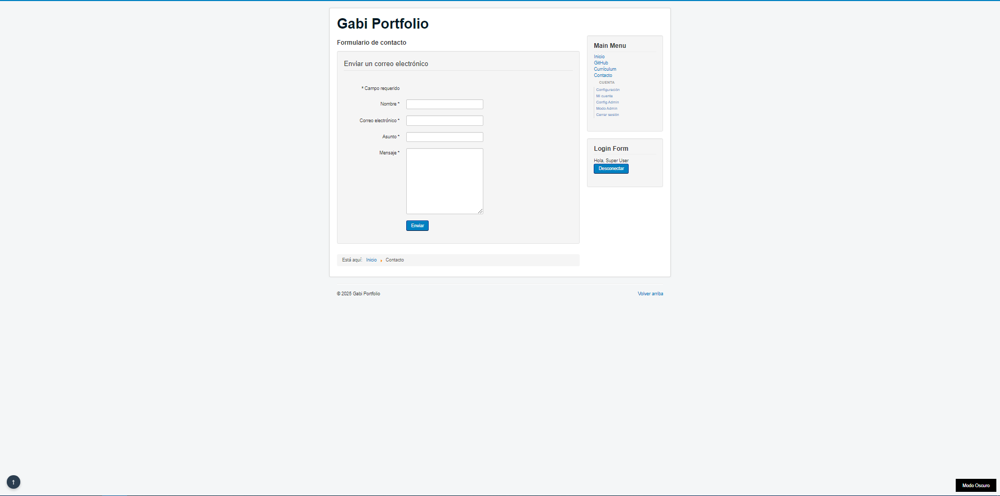

# Documentación. Deben incluir imágenes que demuestren los contenidos evaluables. Además deberá incluir el mapa de la web y el diseño de la interfaz. 2 puntos.

## Mapa de navegación web.

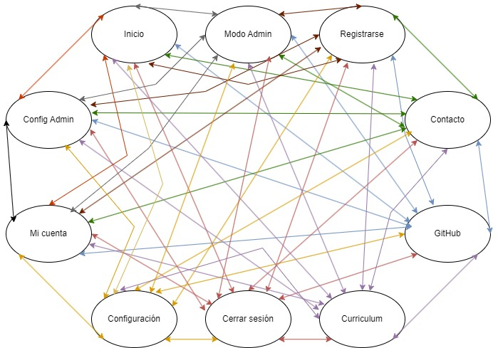

## Diseño del Interfaz.

#### Inicio.
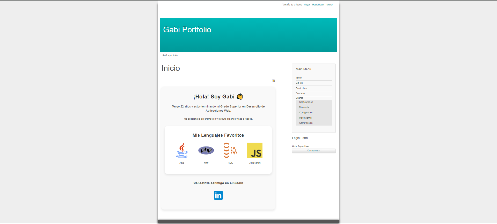

#### Contacto.
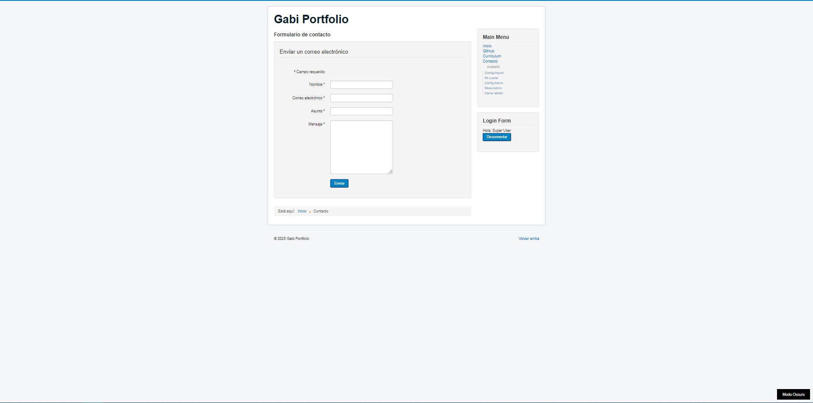

#### Cerrar Sesión.
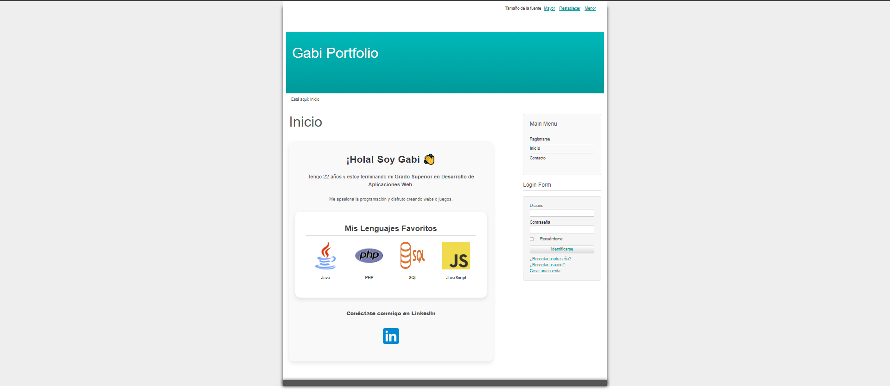

#### Configuración del administrador.

#### Configuración.
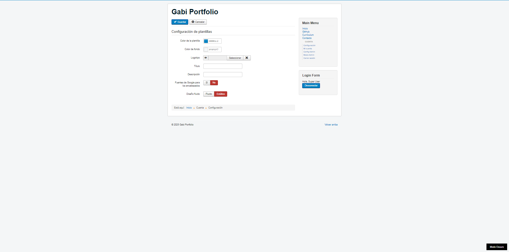

#### Currículum.
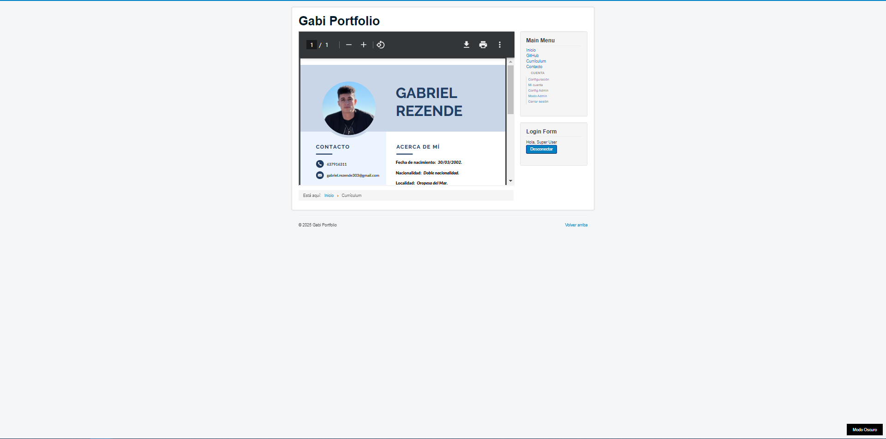

#### Mi cuenta.
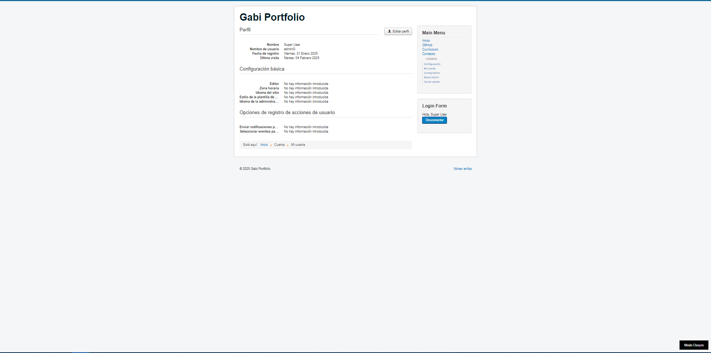

#### Modo administrador (primero te pedira el usuario y contraseña).
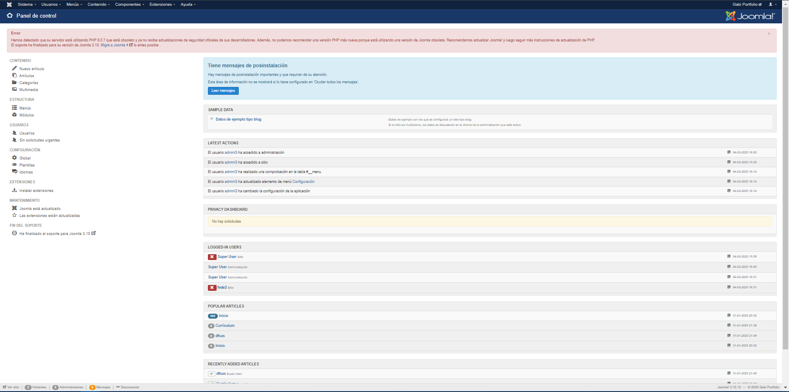

#### MENU.
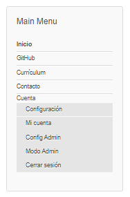

# Como punto adicional se sugiere la subida o desarrollo del sitio web en un hosting real de internet, preferiblemente gratuito, donde cualquier usuario pueda acceder a él.
