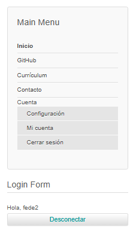
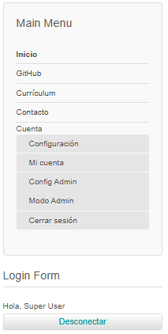
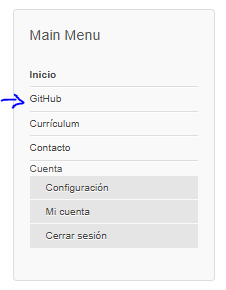
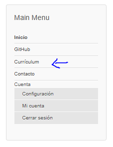
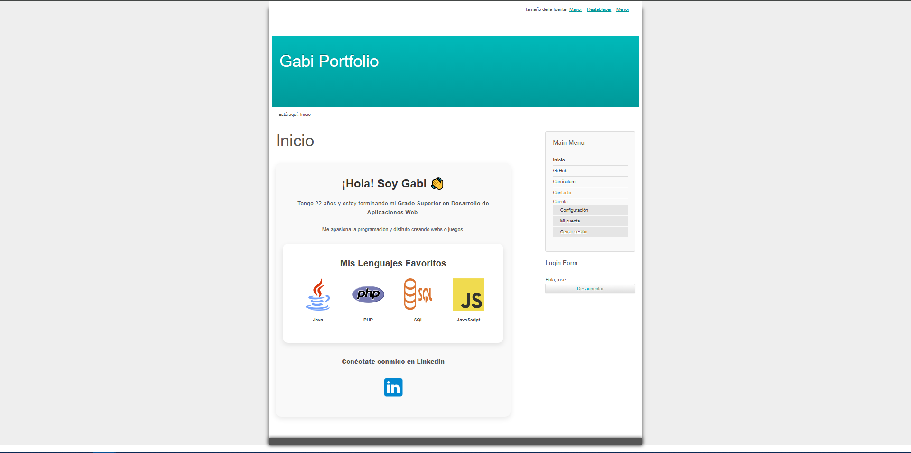
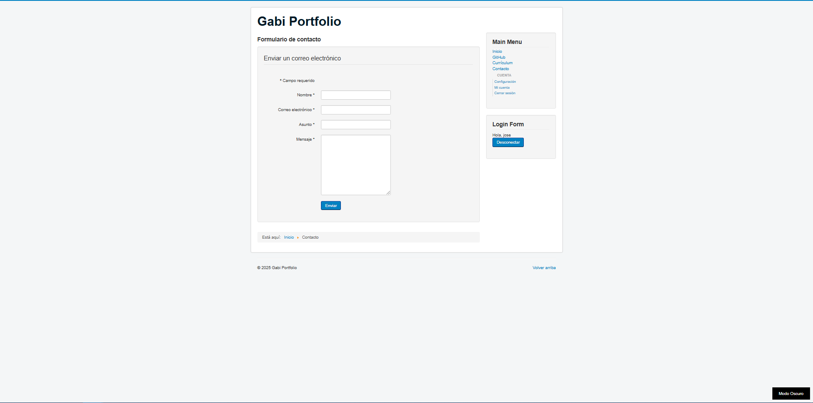
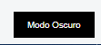
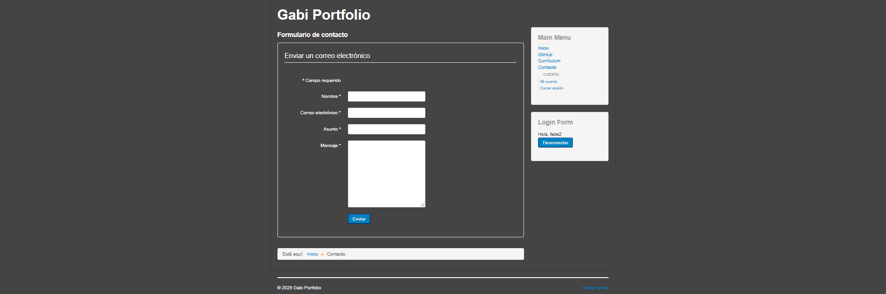

# Página principal
Que será la página de presentación de uno mismo, incluyendo tu descripción. **1 punto.**

---

# Uso de diferentes usuarios, mediante la opción de registro. **1 punto.**

---

# Uso de un menú o de una zona personalizada para el usuario registrado. **1 punto.**

### Este es el menú de un user, sin ningún permiso. 

### Este es el menú del Admin, CON permisos.

---

# Visión del repositorio personal de GitHub. **1.5 puntos.**

### Enlace directo a GitHub a través del menú.

---

# Visor de PDF que contenga el Currículum, con opción de descarga. El Currículum debe estar en formato .pdf. **1 punto.**

---

# Uso de un tema común propio (No el base de Cassiopeia) para todo el sitio Web. **0.5 puntos.**

---

# Zona para contactar, con enlace para enviar un correo. **1 punto.**

---

# Extras. **0.5 puntos máximo cada extra, 1 punto máximo en total.**

#### He creado el **MODO OSCURO** que es un botón que está en la parte inferior de la página, lo que hace es que la página se vuelve oscura.

##### Foto del botón.

###### Foto de la página de contacto sin el modo oscuro.

.PNG)

###### Foto de la página de contacto CON el modo oscuro.

###### Foto de la página "Mi Cuenta" sin el modo oscuro.

.PNG)

###### Foto de la página "Mi Cuenta" CON el modo oscuro.

.PNG)

---

#### He creado una **flecha hacia arriba** como botón que, al pulsarla, sube la página hasta arriba para que no tengas que estar subiendo con el mouse.

##### Foto del icono de la flecha.

##### Cómo queda en la página.

---

# Documentación. 
Debe incluir imágenes que demuestren los contenidos evaluables. Además, deberá incluir el mapa de la web y el diseño de la interfaz. **2 puntos.**

## Mapa de navegación web.

---

## Diseño de la Interfaz.

#### Inicio.

#### Contacto.

#### Cerrar Sesión.

#### Configuración del administrador.

#### Configuración.

#### Currículum.

#### Mi cuenta.

#### Modo administrador (primero te pedirá el usuario y contraseña).

#### MENÚ.

---

# Como punto adicional se sugiere la subida o desarrollo del sitio web en un hosting real de internet, preferiblemente gratuito, donde cualquier usuario pueda acceder a él.

